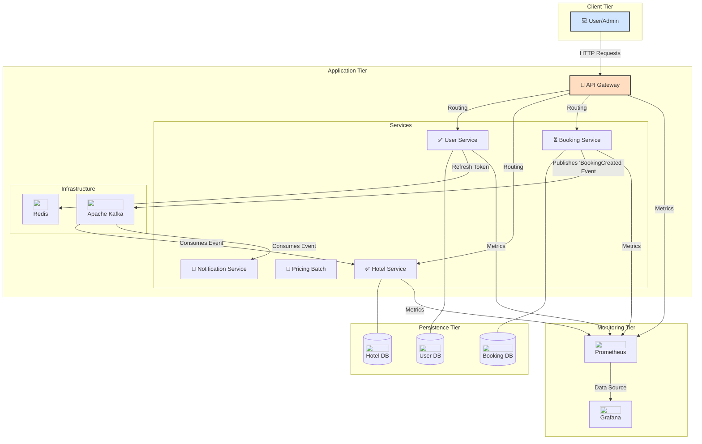

# Hotel Booking Project (HBP)

MSA(Microservices Architecture)와 EDA(Event-Driven Architecture)를 활용한 호텔 관리 및 예약 시스템입니다. 

## 1. 소개

본 프로젝트는 7년간 C#과 .NET 환경에서 쌓아온 백엔드 개발 경험을 바탕으로, Java와 Spring 생태계에 대한 깊이 있는 학습과 실무 적용을 목표로 합니다. 또한 최신 분산 시스템 설계 역량을 강화를 목표로 합니다.

단순히 새로운 기술을 사용하는 것을 넘어 MSA와 EDA를 직접 설계하고 구현하며 마주치는 기술적 과제들을 해결하는 데 집중했습니다. 이를 통해 대용량 트래픽 처리 능력과 확장성 및 안정성이 높은 시스템을 구축하는 경험을 쌓고자 했습니다.

## 2. 아키텍처

각 도메인 별로 책임을 분리한 마이크로서비스 아키텍처를 채택했습니다. 서비스 간의 결합도를 낮추고 독립적인 개발 및 배포를 지향합니다.

### 2.1. 시스템 구성도



### 2.2. 마이크로서비스 구성

본 프로젝트는 지속적으로 개발이 진행 중인 '살아있는' 프로젝트입니다. 각 서비스의 현재 개발 상태는 다음과 같습니다. 

(✅: `구현 완료`, ⏳: `개발 중`, 📝: `구현 예정`)

- 📝 **API Gateway**: 시스템의 단일 진입점으로, 모든 클라이언트 요청에 인증, 인가 및 라우팅을 담당합니다.
- ✅ **사용자 서비스 (Users Service)**: 회원 가입, 로그인 등 사용자 인증 및 정보 관리를 담당합니다.
- ✅ **호텔 서비스 (Hotels Service)**: 호텔, 객실, 요금 등 호텔의 핵심 정보를 등록하고 관리합니다.
- ⏳ **예약 서비스 (Booking Service)**: 사용자의 객실 예약 요청을 처리하고 예약 상태를 관리합니다.
- 📝 **요금 계산 서비스 (Pricing Batch)**: 주기적인 스케줄링을 통해 시즌, 프로모션 등 다양한 요인에 따른 객실 요금을 계산하고 업데이트합니다.
- 📝 **모니터링 (Monitoring)**: 각 서비스의 상태와 성능 지표를 실시간으로 모니터링합니다.
- 📝 **알림 서비스 (Notification)**: 예약 확인, 취소 등 사용자에게 이메일 알림을 전송합니다.

### 2.3. 서비스 통신

서비스 간의 의존성을 제거하고 탄력적인 시스템을 구축하기 위해 이벤트 기반의 비동기 통신을 활용합니다. Apache Kafka를 메시지 브로커로 사용하여 이벤트를 발행하고 구독하는 패턴을 구현했습니다.

예를 들어, 예약이 완료되면 `Booking Service`가 `BookingCreated` 이벤트를 발행하고, `Hotel Service`와 `Notification Service`가 이를 구독하여 각각 재고 관리 및 사용자 알림을 처리합니다.

## 3. 기술 스택

| 구분 | 기술                                     | 이유 |
| :--- |:---------------------------------------| :--- |
| **Backend** | `Java 17`, `Spring Boot 3`             | 안정적인 LTS 버전과 최신 Spring 생태계의 기능을 활용하기 위해 선택 |
| **Persistence** | `Spring Data JPA`, `PostgreSQL`        | ORM을 통한 생산성 향상 및 안정적인 RDBMS 채택 |
| **Cache & In-Memory** | `Redis`                                | 빠른 응답 속도가 필요한 요금 정보 캐싱 및 Refresh Token 저장소로 활용 |
| **Message Queue** | `Apache Kafka`                         | MSA 환경에서 서비스 간 결합도를 낮추고, 예약 관련 이벤트를 안정적으로 처리하기 위해 선택 |
| **Testing** | `JUnit 5`, `Mockito`, `Testcontainers` | 단위/통합 테스트를 통해 코드의 신뢰성을 확보하고, 실제 운영 환경과 유사한 테스트 환경을 구축 |
| **DevOps** | `Docker`, `Docker-Compose`             | 개발 환경의 일관성을 유지하고, 간편하게 전체 시스템을 구성 |
| **Monitoring** | `Prometheus`, `Grafana`                | MSA 환경에서 필수적인 서비스 상태 및 성능 지표를 시각적으로 모니터링 |

## 4. 기술적 도전 및 해결 과정

본 프로젝트를 진행하며 마주친 주요 기술적 과제와 해결 노력입니다. 이는 현재 구현되었거나 문제 해결을 위해 깊이 있게 학습 중이거나 설계 중인 내용들을 포함합니다.

### 4.1. MSA 구조 설계 및 빌드 환경 구축

- **문제 상황**: 하나의 프로젝트가 아닌 다수의 마이크로서비스를 동일한 프로젝트에 구성해야 했고, 각 서비스마다 `build.gradle` 파일에 중복되는 의존성(예: Spring Boot, Lombok 등)과 설정이 많아졌습니다. 이로 인해 유지보수가 어려워지고 새로운 서비스를 추가할 때마다 반복적인 설정 작업을 해야 하는 비효율을 초래했습니다.
- **해결 과정**
  1. **Gradle 멀티 모듈 프로젝트**: 전체 시스템을 하나의 루트 프로젝트 아래에 각 마이크로서비스가 서브 모듈로 구성되는 **Gradle 멀티 모듈 구조**로 설계했습니다. 이를 통해 하나의 저장소(Monorepo)에서 여러 서비스를 통합적으로 관리하고 모듈 간의 의존성을 명확하게 설정할 수 있었습니다.
  2. **`buildSrc`를 이용한 공통 설정 관리**: Gradle의 `buildSrc` 디렉토리를 활용하여 공통으로 사용되는 의존성 버전, 플러그인 설정 등을 담은 'Convention Plugin'을 직접 만들었습니다. 각 서비스 모듈의 `build.gradle` 파일에서는 이 플러그인을 한 줄만 추가함으로써 공통 설정을 재사용할 수 있도록 개선했습니다. 이로써 빌드 스크립트의 중복을 제거하고 전체 서비스의 의존성 버전을 중앙에서 일관되게 관리할 수 있게 되었습니다.

### 4.2. 유연하고 테스트 가능한 동적 쿼리 구현

- **문제 상황**: 사용자의 검색 조건(날짜, 최소/최대 숙박일, 계산 타입 등)에 따라 다양한 조합의 동적 쿼리 생성이 필요했습니다. 로우 쿼리를 직접 작성하는 것은 유지보수성과 가독성이 떨어지고 컴파일 타임에 오류를 잡을 수 없고 테스트가 어렵다는 문제가 있었습니다.
- **해결 과정**
  1. **JPA Specification**(JPA 명세)을 도입하여 동적 쿼리를 타입-세이프(Type-Safe)하게 작성했습니다. 각 검색 조건을 별도의 Specification 클래스로 분리하여 코드의 재사용성과 가독성을 높이고 테스트 용이성을 확보했습니다.
  2. **향후 계획**: 현재는 JPA Specification을 사용하고 있지만, 더 직관적이고 유연한 쿼리 작성을 위해 **Querydsl**로 전환하는 것을 학습 및 계획하고 있습니다.

### 4.3. Blocking I/O 환경에서의 처리량(Throughput) 향상

- **문제 상황**: Spring MVC의 기본 동작 모델인 'Thread-per-Request'는 외부 API 호출이나 데이터베이스 쿼리와 같은 I/O 작업에서 스레드가 블로킹되어 서버 전체의 처리량 저하를 유발할 수 있습니다.
- **해결 과정**
  1. `CompletableFuture`를 활용하여 I/O 작업을 별도의 스레드 풀에서 비동기적으로 처리하도록 구현했습니다. 이를 통해 메인 스레드는 블로킹되지 않고 즉시 다른 요청을 처리할 수 있게 되어 한정된 스레드 풀 자원을 효율적으로 사용하여 시스템 전체의 처리량을 향상시켰습니다.
  2. **향후 계획**: 현재는 기본 스레드 풀을 사용하고 있지만, 부하 테스트를 통해 최적의 스레드 풀 크기를 결정하고 커스텀 스레드 풀을 구성하여 성능을 더욱 최적화할 계획을 가지고 있습니다.

### 4.4. 분산 환경에서의 데이터 정합성 보장 (예정)

- **문제 정의**: MSA 환경에서는 단일 트랜잭션으로 여러 서비스의 데이터를 동시에 변경할 수 없습니다. 예를 들어, 예약 생성 시 `예약 서비스`에서 예약이 성공하면 `호텔 서비스`에서 객실 재고를 차감하는 작업이 반드시 성공해야 합니다. 이 두 작업이 모두 성공하거나 모두 실패해야 데이터의 정합성을 유지할 수 있습니다.
- **해결 방안(설계)**: 이 문제를 해결하기 위해 SAGA 패턴을 적용할 계획입니다.
  - `예약 서비스`가 트랜잭션의 전체 흐름을 지휘하는 오케스트레이터(Orchestrator) 역할을 수행합니다.
  - 예약 시작 시, `예약 서비스`는 `호텔 서비스`에 '재고 확인 및 선점' 요청하는 등 순차적으로 트랜잭션을 진행합니다.
  - 만약 중간 단계에서 작업이 실패할 경우, 이미 완료된 이전 단계의 작업을 취소하는 보상 트랜잭션(Compensating Transaction)을 실행하여 데이터 정합성을 유지합니다.

### 4.5. 이벤트 기반 시스템에서의 메시지 처리 신뢰성 확보 (예정)

- **문제 정의**: 이벤트 기반 아키텍처에서는 서비스 간의 통신이 비동기적으로 이루어지기 때문에 메시지가 재전송되거나 중복 처리될 위험이 있습니다. 이는 중복 예약이나 재고 불일치와 같은 심각한 데이터 정합성 문제를 초래할 수 있습니다.
- **해결 방안(설계)**: Consumer 로직에 멱등성(Idempotency)을 부여하여 이 문제를 해결할 계획입니다.
  - 모든 이벤트 메시지에 고유 식별자(ID)를 부여합니다.
  - Consumer는 메시지를 처리하기 전, Redis와 같은 외부 저장소를 조회하여 해당 메시지 ID가 이미 처리되었는지 확인합니다.
  - 처음 처리하는 메시지일 경우에만 로직을 수행하고 완료 후 메시지 ID를 저장소에 기록합니다. 이미 처리된 메시지라면 무시하여 중복 처리를 방지합니다. 이를 통해 동일한 메시지가 여러 번 전달되더라도 비즈니스 로직은 단 한 번만 실행되는 것을 보장할 수 있습니다.

## 5. 테스트 전략

코드의 안정성과 신뢰도를 높이기 위해 단위 테스트와 통합 테스트를 작성했습니다. 특히, 실제 운영 환경과의 차이로 인해 발생할 수 있는 문제를 사전에 방지하고자 `Testcontainers`를 활용하여 모든 테스트가 Docker 컨테이너 위(PostgreSQL, Redis, Kafka)에서 실행되도록 구성했습니다. 이를 통해 개발 단계에서부터 실제 서비스 환경과 거의 동일한 환경에서 코드의 동작을 검증할 수 있습니다.

## 6. 실행 방법

프로젝트를 로컬 환경에서 실행하는 방법입니다. Docker가 설치되어 있어야 합니다.

### 6.1. 환경 변수 설정

프로젝트를 실행하기 전에 각 서비스에서 사용할 환경 변수를 설정해야 합니다.

1. 프로젝트 루트 디렉토리에 `.env` 파일을 생성합니다.
2. 아래 내용을 복사하여 `.env` 파일에 붙여넣습니다. 이 변수들은 Docker Compose에서 사용됩니다.

```dotenv
HOTEL_SERVICE_PORT=8082

HOTEL_DB_NAME=hotel_db
HOTEL_DB_USERNAME=user_admin
HOTEL_DB_PASSWORD=user_password
HOTEL_DB_PORT=5434

USER_SERVICE_PORT=8083

USER_DB_NAME=user_db
USER_DB_USERNAME=user_admin
USER_DB_PASSWORD=user_password
USER_DB_PORT=5435

USER_REDIS_PASSWORD=redis_password
USER_REDIS_PORT=6380

JWT_SECRET_KEY=aG90ZWwtYm9va2luZy1wbGF0Zm9ybS1zcHJpbmctYm9vdC1qd3Qtc2VjcmV0LWtleS1mb3ItcHJvamVjdC1iYWNra3UgMTIzNDU2Nzg5MA==

```

### 6.2. 애플리케이션 실행

```bash
# 1. 프로젝트를 복제합니다.
git clone git@github.com:f-lab-edu/hotel-booking-platform.git

# 2. 프로젝트 디렉토리로 이동합니다.
cd hotel-booking-platform

# 3. Docker Compose를 사용하여 모든 서비스(웹 애플리케이션, PostgreSQL, Kafka, Redis)를 실행합니다.
docker-compose up -d

# 4. 각 서비스가 정상적으로 실행되었는지 확인합니다.
docker-compose ps
```

명령어를 실행한 후, 각 서비스가 정상적으로 실행되었는지 확인합니다. 모든 서비스가 `Up` 상태로 표시되면 정상적으로 구동된 것입니다. 이제 API Gateway를 통해 각 마이크로서비스에 접근할 수 있습니다.

## 7. API 문서 (예정)

API 문서는 Swagger UI를 통해 제공될 예정입니다.

## 8. 향후 계획 (Roadmap)

이 프로젝트는 아래와 같은 로드맵에 따라 지속적으로 발전시켜 나갈 계획입니다.

### Phase 1: 핵심 기능 구현

- [x] 사용자 서비스 (User Service) 기능 구현
- [x] 호텔 서비스 (Hotel Service) 기능 구현
- [ ] 예약 서비스 (Booking Service) 기능 구현 (Saga 패턴 적용 포함)
- [ ] 메시지 멱등성 처리 구현으로 데이터 신뢰성 확보

### Phase 2: 시스템 확장 및 운영 기반 구축

- [x] 시스템 구성도 다이어그램 작성
- [ ] API Gateway 기능 구현 및 Swagger를 통한 API 문서화 적용
- [ ] Prometheus, Grafana를 이용한 모니터링 시스템 구축
- [ ] 요금 계산 배치, 알림 서비스 등 서브 시스템 구현

### Phase 3: 배포 자동화 및 고도화

- [ ] CI/CD 파이프라인 구축
- [ ] Kubernetes를 이용한 컨테이너 오케스트레이션
- [ ] nGrinder 등을 이용한 부하 테스트 및 성능 분석/개선
